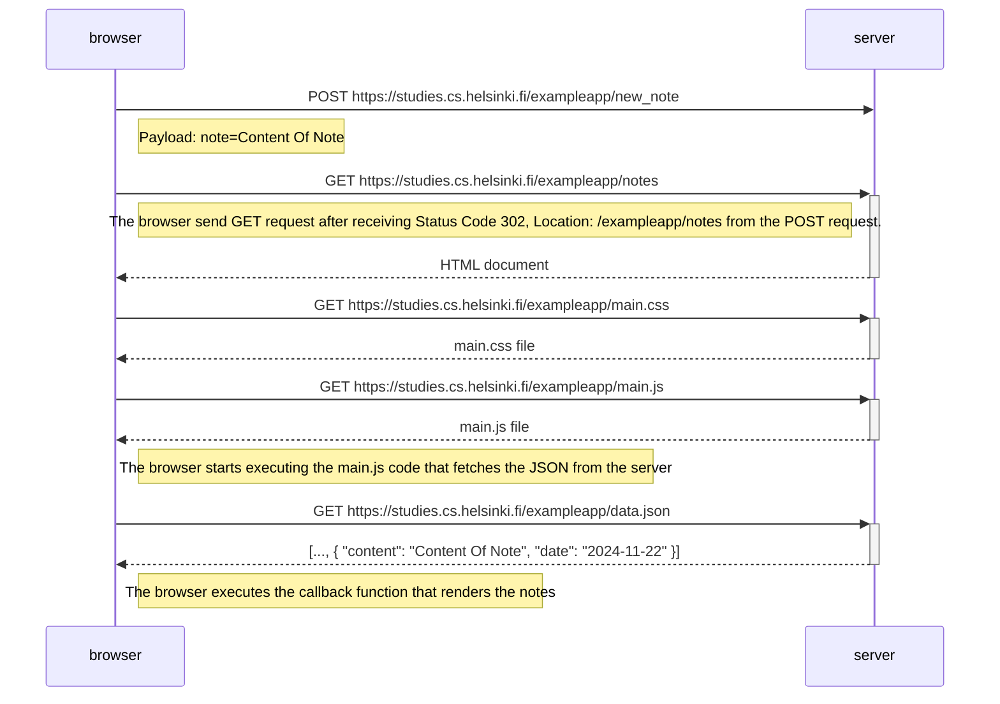

```mermaid
sequenceDiagram
    participant browser
    participant server

    browser ->> server: POST https://studies.cs.helsinki.fi/exampleapp/new_note
    Note right of browser: Payload: note=Content Of Note

    browser ->>+ server: GET https://studies.cs.helsinki.fi/exampleapp/notes
    Note right of browser: The browser send GET request after receiving Status Code 302, Location: /exampleapp/notes from the POST request.
    server -->>-browser: HTML document

    browser->>+server: GET https://studies.cs.helsinki.fi/exampleapp/main.css
    server-->>-browser: main.css file

    browser->>+server: GET https://studies.cs.helsinki.fi/exampleapp/main.js
    server-->>-browser: main.js file

    Note right of browser: The browser starts executing the main.js code that fetches the JSON from the server

    browser->>+server: GET https://studies.cs.helsinki.fi/exampleapp/data.json
    server-->>-browser: [..., { "content": "Content Of Note", "date": "2024-11-22" }]

    Note right of browser: The browser executes the callback function that renders the notes

```