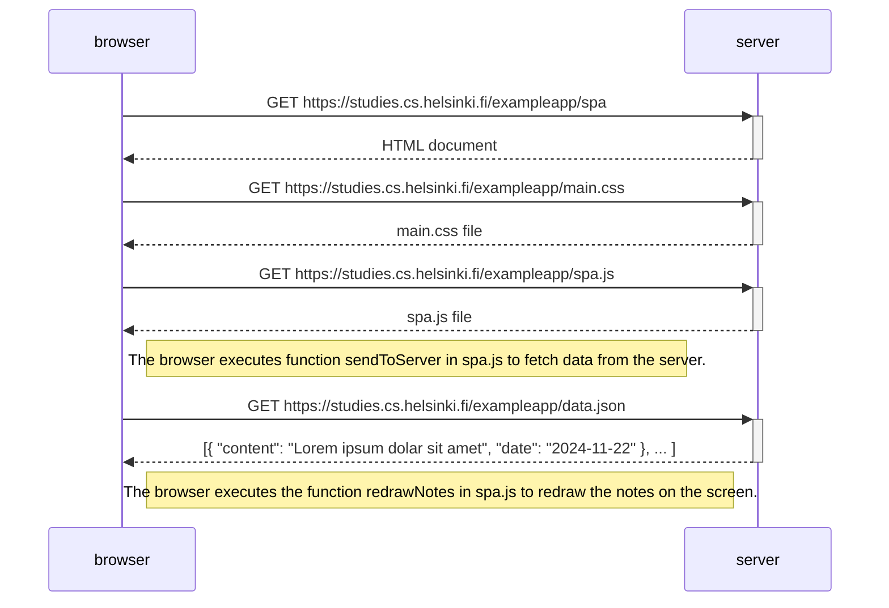

```mermaid
sequenceDiagram
    participant browser
    participant server

    browser ->>+ server: GET https://studies.cs.helsinki.fi/exampleapp/spa
    server -->>-browser: HTML document

    browser ->>+ server: GET https://studies.cs.helsinki.fi/exampleapp/main.css
    server -->>-browser: main.css file

    
    browser ->>+ server: GET https://studies.cs.helsinki.fi/exampleapp/spa.js
    server -->>-browser: spa.js file

    Note right of browser: The browser executes function sendToServer in spa.js to fetch data from the server.


    browser ->>+ server: GET https://studies.cs.helsinki.fi/exampleapp/data.json
    server -->>-browser: [{ "content": "Lorem ipsum dolar sit amet", "date": "2024-11-22" }, ... ]

    Note right of browser: The browser executes the function redrawNotes in spa.js to redraw the notes on the screen.

```