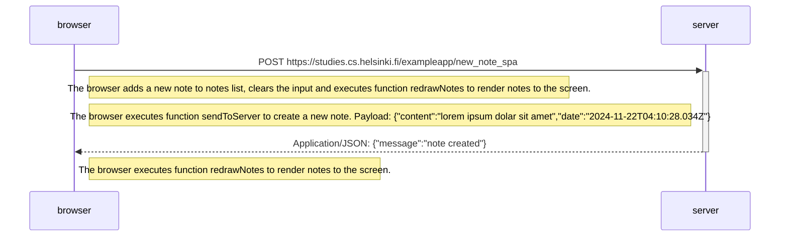

```mermaid
sequenceDiagram
    participant browser
    participant server

    browser ->>+server: POST https://studies.cs.helsinki.fi/exampleapp/new_note_spa
    Note right of browser: The browser adds a new note to notes list, clears the input and executes function redrawNotes to render notes to the screen.
    Note right of browser: The browser executes function sendToServer to create a new note. Payload: {"content":"lorem ipsum dolar sit amet","date":"2024-11-22T04:10:28.034Z"}

    server -->>-browser: Application/JSON: {"message":"note created"} 

    
    Note right of browser: The browser executes function redrawNotes to render notes to the screen.
```